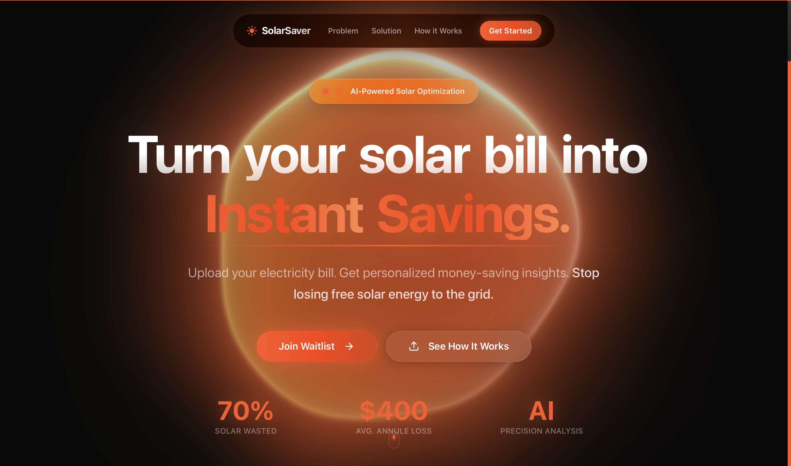

# Solar Saver - Framer Motion Template

A high-performance, premium landing page template featuring advanced Framer Motion animations, complex 3D backgrounds, and a clean modern UI.



## Features

- ⚡ **Next.js 15 + React 19** - The latest stack for best performance.
- 🎬 **Framer Motion** - Scroll-linked animations, entrance effects, and micro-interactions.
- 🏎️ **Hyperspeed 3D Background** - Custom shader-based background effect.
- 🎨 **Tailwind CSS v4** - Next-gen styling with zero-runtime overhead.
- 📱 **Fully Responsive** - Optimized for Mobile, Tablet, and Desktop.
- 🔍 **SEO Ready** - Includes robots.txt, sitemap.xml, and dynamic OpenGraph social images.
- 📲 **PWA Supported** - Installable as a web app with `manifest.ts`.
- ♿ **Accessible** - ARIA labels, semantic HTML, and keyboard navigation.
- 🌓 **Dark Mode Native** - Designed with a sleek dark aesthetic.

## Getting Started

1. **Clone and Install**
   ```bash
   git clone <your-repo>
   cd solar-saver-template
   npm install
   ```

2. **Run Development Server**
   ```bash
   npm run dev
   ```
   Open [http://localhost:3000](http://localhost:3000) to view it.

3. **Build for Production**
   ```bash
   npm run build
   ```

## Customization

### text
- Edit content in `app/page.tsx` and individual section components in `components/sections/`.
- The "Waitlist" form logic is mocked in `components/sections/Waitlist.tsx`. to connect a real backend, replace the `handleSubmit` function.

### Styling
- Colors and typography can be adjusted in `app/globals.css`.
- Tailwind configuration is handled via CSS variables and the v4 compilation process.

## Project Structure

```
├── app/                  # Next.js App Router
├── components/
│   ├── layout/           # Navbar, Footer
│   ├── sections/         # Feature sections (Hero, Problem, Solution...)
│   ├── ui/               # Reusable UI components (Buttons, etc.)
│   └── Hyperspeed.tsx    # 3D Background Component
├── public/               # Static assets
└── lib/                  # Utilities
```

## Credits

- Built with [Next.js](https://nextjs.org)
- Animations by [Framer Motion](https://www.framer.com/motion/)
- Icons by [Lucide](https://lucide.dev)
- pre-built animation components by [Reactbit](https://reactbits.dev)
